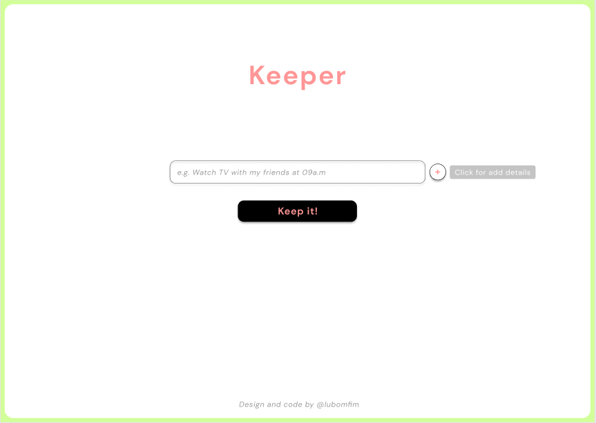

# Keeper

Um website para adicionar suas tarefas diárias com detalhes.

## Objetivo

Prática no desenvolvimento de layouts complexos e completos, com uso das ferramentas básicas front-end: HTML, CSS e JS.

## Design

[Figma](https://www.figma.com/proto/snZLdVmiqA0OXaZkEMYmvz/TODO?node-id=1%3A45&viewport=-315%2C344%2C0.3497963547706604&scaling=min-zoom)

## Status

Em construção

## Tecnologias

- HTML
- CSS
- Javascript

## Etapas do Desenvolvimento

- [x] Design
- [ ] HTML
- [ ] CSS
- [ ] Interação com JS
